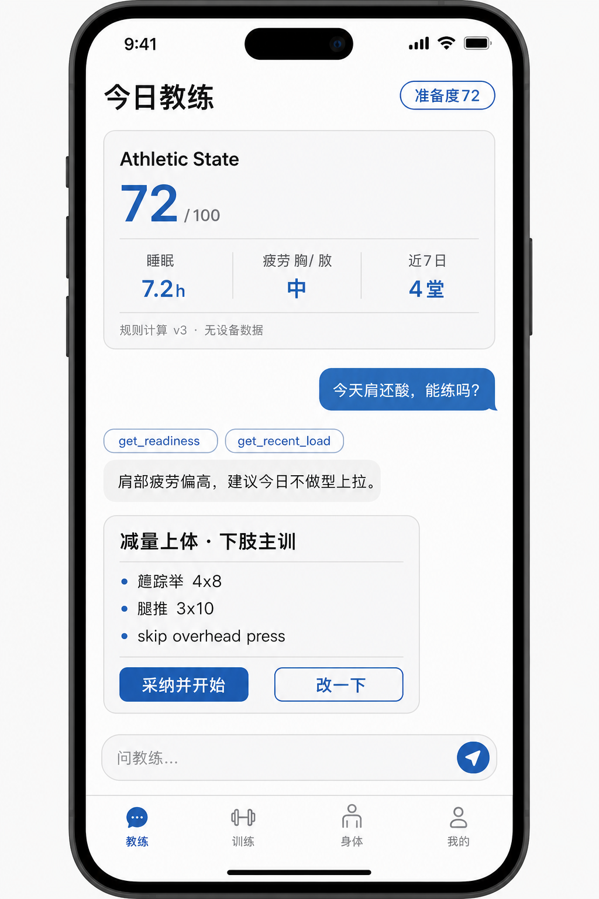
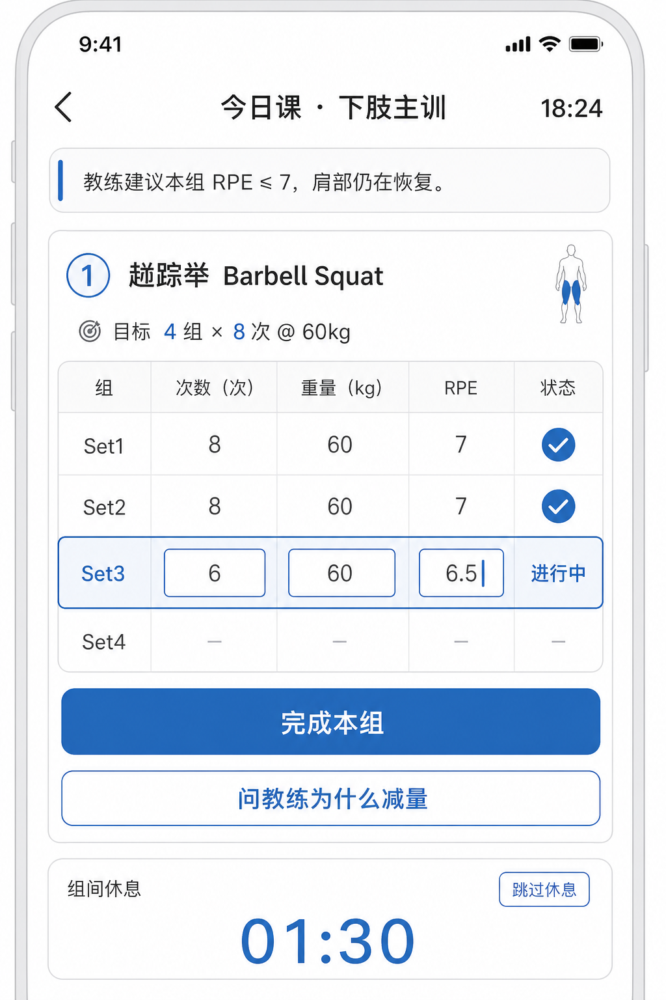

# App 端原型

> Smart Fitness · 移动端只做 **Expo 单仓**（不并行 Flutter）  
> 产品核：Agent 教练回合，不是「训练日志里塞一个聊天 Tab」  
> 日期：2026-08-23

配套线框：[教练首页观感](assets/app-coach-home-prototype.png)、[训练中观感](assets/app-session-live-prototype.png)。生成图仅作视觉参考，页面结构与文案以本文为准。

---

## 1. 信息架构

默认落地页是 **教练**。冷启动先进教练首页，并自动开一次轻量 Observe（读准备度 + 约束，不强制出完整处方）。

```text
登录 / 注册
    │
    ▼
建档（仅一次）── 目标 / 可练天数 / 器材 / 伤痛
    │
    ▼
┌─────────┬─────────┬─────────┬─────────┐
│  教练*  │  训练   │  身体   │  我的   │
└─────────┴─────────┴─────────┴─────────┘
     │         │         │         │
     │         │         │         └─ 档案、约束、只读策略版本
     │         │         └─ AthleticState + 手填指标
     │         └─ 进行中的课 + SessionLog 历史
     └─ 回合 / 建议卡 / 确认（产品核）
```

| Tab | 职责 | 不是什么 |
|-----|------|----------|
| 教练 | Observe、流式对话、结构化 Advice、确认 | 闲聊陪护 |
| 训练 | 进行中记组 + 历史课 | 计划模板浏览器 |
| 身体 | 准备度、肌群疲劳、睡眠；分数带来源与 `calc_version` | 另一套分析聊天 |
| 我的 | 目标/器材/伤痛；通知；导出；只读策略版本号 | 用户改 Prompt |

主路径：

```text
教练首页 → 流式回合 → 建议确认 → 训练中记组 → 复盘回写准备度
```

---

## 2. 页面流

登录/注册省略。建档只做一次；约束变更必须同步服务端，供下一次 Observe 读取。

| 步骤 | 页面 | 关键交互 | 落库 |
|------|------|----------|------|
| 0 | 建档 | 目标、每周可练、器材、伤痛 | `athlete` + `athlete_constraint` |
| 1 | 教练首页 | 准备度卡 + 上一条 Advice + 输入框 | 可触发轻量 `coach_run` |
| 2 | 流式回合 | SSE：`token` / `tool.*` / `advice` | `coach_run` + `coach_event` |
| 3 | 建议确认 | 采纳 / 只要休息 / 忽略 | `advice.status` + `decision_event`；采纳才有 `session_log` |
| 4 | 训练中 | 逐组 reps / kg / RPE；可追问教练 | `set_log`；不问 LLM 要重量 |
| 5 | 准备度 | 疲劳分、睡眠、计算版本 | 只读 `athletic_state` 最新快照 |

---

## 3. 页面线框

### 3.1 建档

```text
┌─────────────────────────┐
│ 9:41        教练建档    │
│ 先让教练认识你          │
│ 目标、器材、伤痛会进入  │
│ 约束，每回合 Observe 读 │
│                         │
│ 目标                    │
│ [增肌] [减脂] [力量]    │
│                         │
│ 本周可练 / 场馆器材     │
│ 健身房 · 杠铃/史密斯/腿举│
│                         │
│ 偏好（Retrieve 必带）   │
│ 喜欢自由重量 · 讨厌腿屈伸│
│                         │
│ 硬约束                  │
│ 右肩酸 · 避免过头推举   │
│                         │
│ [ 开始第一次教练回合 ]  │
│ 教练  训练  身体  我的  │
└─────────────────────────┘
```

要点：约束不是本地表单缓存；写入后立即参与 Observe。

### 3.2 教练首页（默认）



```text
┌─────────────────────────┐
│ 今日教练     准备度 72  │
│ ┌─────────────────────┐ │
│ │ 准备度 72   规则 v3 │ │
│ │ 睡眠 7.2h · 胸/肩中 │ │
│ │ 7 日 4 堂           │ │
│ └─────────────────────┘ │
│ 教练：肩部仍在恢复。    │
│ 今天更适合下肢，或休息。│
│ ┌ 建议 · 减量上体 ────┐ │
│ │ 深蹲 4×8 · 腿推 3×10│ │
│ │ 跳过肩推            │ │
│ │ [采纳并开始] [改一下]│ │
│ └─────────────────────┘ │
│ ┌ 问教练… ────────────┐ │
│ └─────────────────────┘ │
│ 教练  训练  身体  我的  │
└─────────────────────────┘
```

### 3.3 流式回合

连接按 **runId**，禁止按用户广播。Tool chip 用于可信（「已查看准备度」），P1 可改成自然语言，不把 Trace 字段级暴露给用户。

```text
用户：今天肩还酸，能练推吗？
chip: get_readiness    chip: get_recent_load
流式 token…
教练：近 5 日肩部容量偏高，准备度 72。
      不建议过头推。可以练下肢，或休息。
事件：token → tool → advice（尚未确认）
```

### 3.4 建议确认

Advice 是一等对象：`type`、`actions[]`、`evidence[]`、`confirmRequired`。气泡文案只是解释层。

```text
减量上体 · 下肢主训
证据：肩疲劳 7.4/10 · 昨日推类 · 睡眠尚可

动作        组×次
杠铃深蹲    4×8 @ 60kg
腿推        3×10
腿弯举      3×12
肩推        跳过

确认后才写入 SessionLog。LLM 不能直接落库。
[采纳并开始]  [只要休息]  [忽略]
```

### 3.5 训练中



记组走 REST `/v1/sessions/{id}/sets`（或 `log_set` 服务端口），**不经过 LLM 生成重量**。顶部教练条只读当前 Advice 约束。

```text
训练中 18:24
教练：本组 RPE ≤ 7，肩仍在恢复。

杠铃深蹲
组  成绩
1   8 × 60  完成
2   8 × 60  完成
3   进行中  reps / kg / RPE
4   —

[ 完成本组 ]
休息 1:30 · 可随时问教练
```

### 3.6 准备度

分数必须带来源和 `calc_version`。无手表时用负荷 + 主观；P2 接设备后同一屏只换数据源。

```text
72 / 100
计算版本 v3 · 数据源 规则（无设备）

肌群  疲劳
胸    5.1
肩    7.4
背    3.0
腿    2.2

睡眠 7.2h · 主观疲劳 4/10 · 手填心率 —
```

### 3.7 我的

- 目标与器材  
- 伤痛约束  
- **用量**（P0）：本月系统额度已用/上限；若绑定 BYOK 则展示走自己 Key 的 token（费用以供应商为准）  
- 通知：每日开训前提问  
- 导出训练  
- 关于教练策略版本（只读，用户不能改 Prompt）

系统额度用尽时：教练输入不可发，引导绑定 API Key。BYOK 仍记每一跳用量，不扣平台配额。详见 [04-llm-usage-monitoring.md](04-llm-usage-monitoring.md)。

---

## 4. 流式对话状态机

客户端只认下列 SSE 事件；未知事件忽略、不断流。鉴权：`Authorization: Bearer`，token 不放 query。

| UI 状态 | SSE 事件 | 用户能做什么 |
|---------|----------|----------------|
| idle | — | 发消息 / 采纳首页建议 |
| running | `run.created` + `token` | 可停止 |
| tooling | `tool.start` / `tool.result` | 等待，文案「正在看你的恢复」 |
| awaiting_confirm | `advice` | 采纳 / 修改 / 拒绝 |
| error | `error` | 重试；已生成的 Advice 不丢 |

事件名（与后端契约一致）：

`run.created` → `token` → `tool.start` → `tool.result` → `advice` → `error` | `done`

技术约束（Expo）：使用 `expo/fetch` 读 `ReadableStream`，不要回退成整包 `response.text()`。

---

## 5. 非目标（P0）

- 不做 Flutter 第二仓  
- 不做数字人换装、成就排行（非教练核）  
- 不做端上 Prompt / 路由  
- 不做手表写入（身体页预留数据源字段即可）
