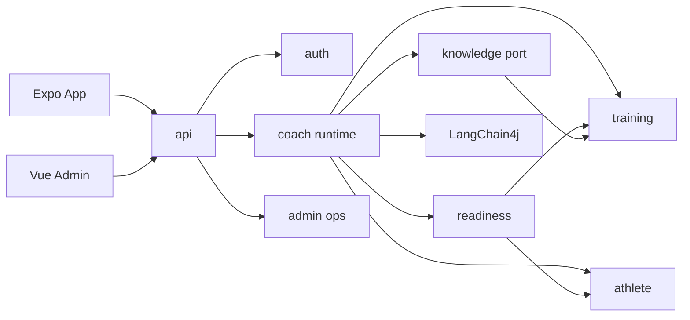
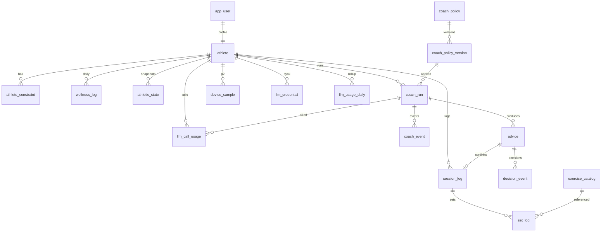

# 后端架构与表结构

> Smart Fitness · Spring Boot 3 / Java 21 / PostgreSQL 16 / Redis / **LangChain4j**（不上 Spring AI）  
> 形态：模块化单体；**Coach Runtime 是核**，领域模块只对 Agent 暴露端口  
> 日期：2026-08-23

---

## 1. 红线

1. LLM 不直连 Mapper。  
2. 写库必须经 Advice 确认（模型看不到 `commit_advice`）。  
3. SSE 绑定 **runId**，禁止按 `userId` 广播。  
4. **每一次 LLM HTTP 调用必须落 `llm_call_usage`。** 缺供应商 usage 则估算并标 `ESTIMATED`，禁止静默丢弃。SYSTEM 与 BYOK 都记账；只有 SYSTEM 扣平台额度。详见 [04-llm-usage-monitoring.md](04-llm-usage-monitoring.md)。

---

## 2. 模块划分

```text
Expo App ──┐
           ├── api（启动 / JWT 过滤 / SSE 入口 / OpenAPI）
Vue Admin ─┘         │
                     ├── auth
                     ├── coach  ← 核（Run / Tool / 流式 / 护栏 / Advice）
                     │     ├── readiness（算分，不调 LLM）
                     │     ├── athlete（档案 / 约束）
                     │     ├── training（动作库 / SessionLog / SetLog）
                     │     ├── knowledge（P0=Catalog 检索；P2=RAG，同一 KnowledgePort）
                     │     └── LangChain4j → LLM Provider
                     └── admin（Policy / Trace / Token 监控 / 采纳统计；独立 JWT）
```



| 模块 | 职责 | 禁止 |
|------|------|------|
| api | 启动、鉴权过滤、SSE 入口、OpenAPI | 写业务 |
| auth | 注册登录 JWT | 读训练数据 |
| athlete | 档案、约束、器材 | 算准备度 |
| readiness | AthleticState 计算与快照 | 调 LLM |
| training | 动作库、SessionLog、SetLog | 拼 Prompt |
| knowledge | KnowledgePort：P0 Catalog 检索，P2 RAG | 写训练记录；无过滤全库召回 |
| coach | Run、Tool、流式、护栏、Advice；**只经 LlmGateway 调模型** | 跨模块注入 Mapper；禁止私自 new ChatModel |
| admin | Policy、Trace、Token 监控、采纳统计 | 使用用户 JWT |

建议 Maven 模块名：`smart-fitness-api` / `-auth` / `-athlete` / `-readiness` / `-training` / `-knowledge` / `-coach` / `-admin` / `-common` / `-infra`。  
`knowledge` P0 只有 Catalog 适配器；P2 加 RAG 适配器。Coach 只依赖 `KnowledgePort`。详见 [05-training-rag.md](05-training-rag.md)。

---

## 3. 一次 Coach Run

```text
1. POST /v1/coach/runs          创建 run，Accept: text/event-stream
2. Observe tools                get_athlete / get_readiness / get_recent_load
3. Guard then LLM               疼痛 → 只允许 rest；propose 过容量规则
4. advice 事件                  客户端确认 → POST /v1/advice/{id}/decide → SessionLog
```

### 3.1 SSE 事件契约

| event | data 要点 |
|-------|-----------|
| `run.created` | `runId`, `policyVersion` |
| `token` | `delta` 文本 |
| `tool.start` | `name`, args 摘要 |
| `tool.result` | `name`, `ok`, 短结果 |
| `advice` | Advice JSON（完整对象） |
| `error` | `code`, `message` |
| `done` | `runId`, `usage` |

未知事件：客户端忽略，不断流。

### 3.2 P0 Tools

| Tool | 作用 | 对模型可见写 |
|------|------|----------------|
| get_athlete | 目标 / 约束 / 器材 | 否 |
| get_readiness | AthleticState 快照 | 否 |
| get_recent_load | 近 7–14 日负荷与主观 | 否 |
| retrieve_exercise_options | 按器械/偏好/模式召回候选动作（P0=catalog，P2=RAG） | 否 |
| propose_session | 一堂处方草稿，**含 alternatives[]** | 否，只出 Advice |
| log_set | 记录实际组数 | 是（校验 session 归属） |
| record_decision | 采纳 / 忽略埋点 | 是 |

`commit_advice` **不对模型暴露**；App 点「采纳」走 REST。

---

## 4. 表结构总图



`device_sample`：P0 可建表，写入关闭。

---

## 5. 核心表说明

| 表 | 关键列 | 说明 |
|----|--------|------|
| app_user | email, password_hash, status | App 登录；与 athlete 1:1。见 07 |
| wellness_log | log_date, sleep_hours, subjective_fatigue | 准备度 v1 输入。见 08 / 09 |
| exercise_catalog | code, equipment, pattern, swap_group, tags | 处方只引用 code；RAG 不替代主数据 |
| athlete_constraint | type, body_part, severity, starts_on, ends_on | 伤痛/医疗/时间；Observe 必读 |
| athletic_state | as_of, readiness, recovery, fatigue_by_muscle jsonb, source, calc_version | **快照表**：每次计算插入新行，不改历史 |
| coach_run | status, trigger, key_source, token_in/out | Run **汇总**；明细在 `llm_call_usage` |
| llm_call_usage | key_source, billed_to, tokens, usage_source, cost | **一次 HTTP 调用一行**（P0 账本） |
| llm_usage_daily | athlete × 日 × key_source | 仪表盘与对账 |
| llm_quota / llm_price_list | token_limit, rpm, 分/千 token | SYSTEM 配额与估算成本 |
| llm_credential | api_key_cipher, fingerprint | BYOK；明文 Key 禁止落库 |
| coach_event | seq, type, payload jsonb | 事件源，可重放流式 UI |
| advice | type, payload, evidence, risk, confirm_required, status | proposed / accepted / rejected / expired |
| session_log / set_log | advice_id, rpe, reps, load_kg | 真实发生；与处方分离 |
| coach_policy / coach_policy_version | system_prompt, tool_flags, guardrails, status | Prompt Ops 发布物 |
| decision_event | advice_id, action, note | 采纳率；不用于 SFT |
| device_sample | type, value, captured_at, source | P2 |
| admin_user | email, role, password_hash | 与 App 用户隔离 |

Advice.status：`proposed` | `accepted` | `rejected` | `expired`  
Advice.type：`rest` | `deload` | `session` | `referral`  
Run.status：`running` | `completed` | `failed` | `cancelled`  
Run.trigger：`open_app` | `user_msg` | `post_workout`

---

DDL 草案见下；**开工以 Flyway 为准，并必须并入 07/08 增补列**（`app_user`、`onboarded_at`、`wellness_log`）。

主键一律 `BIGINT` 雪花；时间一律 `TIMESTAMPTZ`。应用层保证归属（`athlete_id` 过滤），P0 可不建物理外键以免锁竞争，但列与索引必须按下表。

```sql
-- 公共：updated_at 触发器略
-- app_user、athlete.onboarded_at、wellness_log 完整定义见 07、08
-- Token 表见 04；动作种子见 11；开工顺序见 06

CREATE TABLE athlete (
    id              BIGINT PRIMARY KEY,
    user_id         BIGINT NOT NULL UNIQUE,
    display_name    VARCHAR(64) NOT NULL,
    sex             VARCHAR(16),
    birth_date      DATE,
    height_cm       NUMERIC(5,1),
    goal            VARCHAR(32) NOT NULL,          -- HYPERTROPHY / FATLOSS / STRENGTH / REHAB
    weekly_min      INTEGER,
    equipment       JSONB NOT NULL DEFAULT '[]',
    preferences     JSONB NOT NULL DEFAULT '{}',
    onboarded_at    TIMESTAMPTZ,
    created_at      TIMESTAMPTZ NOT NULL DEFAULT now(),
    updated_at      TIMESTAMPTZ NOT NULL DEFAULT now()
);

CREATE TABLE athlete_constraint (
    id              BIGINT PRIMARY KEY,
    athlete_id      BIGINT NOT NULL,
    type            VARCHAR(32) NOT NULL,          -- injury / pain / medical / time / equipment
    body_part       VARCHAR(32),
    severity        SMALLINT,
    starts_on       DATE,
    ends_on         DATE,
    notes           TEXT,
    created_at      TIMESTAMPTZ NOT NULL DEFAULT now()
);
CREATE INDEX idx_constraint_athlete ON athlete_constraint (athlete_id);

CREATE TABLE athletic_state (
    id                  BIGINT PRIMARY KEY,
    athlete_id          BIGINT NOT NULL,
    as_of               TIMESTAMPTZ NOT NULL,
    readiness           SMALLINT NOT NULL,         -- 0-100
    recovery            SMALLINT,
    fatigue_by_muscle   JSONB NOT NULL DEFAULT '{}',
    sleep_hours         NUMERIC(4,1),
    rhr                 SMALLINT,
    hrv                 NUMERIC(6,1),              -- P2
    source              VARCHAR(16) NOT NULL,      -- rule / device / hybrid
    calc_version        VARCHAR(32) NOT NULL,
    created_at          TIMESTAMPTZ NOT NULL DEFAULT now()
);
CREATE INDEX idx_state_athlete_asof ON athletic_state (athlete_id, as_of DESC);

CREATE TABLE coach_policy (
    id              BIGINT PRIMARY KEY,
    name            VARCHAR(64) NOT NULL UNIQUE,
    created_at      TIMESTAMPTZ NOT NULL DEFAULT now()
);

CREATE TABLE coach_policy_version (
    id              BIGINT PRIMARY KEY,
    policy_id       BIGINT NOT NULL,
    version         INTEGER NOT NULL,
    system_prompt   TEXT NOT NULL,
    tool_flags      JSONB NOT NULL DEFAULT '{}',
    guardrails      JSONB NOT NULL DEFAULT '{}',
    status          VARCHAR(16) NOT NULL,          -- draft / gray / active / archived
    gray_percent    SMALLINT NOT NULL DEFAULT 0,
    created_by      BIGINT,
    created_at      TIMESTAMPTZ NOT NULL DEFAULT now(),
    UNIQUE (policy_id, version)
);

CREATE TABLE coach_run (
    id                  BIGINT PRIMARY KEY,
    athlete_id          BIGINT NOT NULL,
    policy_version_id   BIGINT NOT NULL,
    status              VARCHAR(16) NOT NULL,
    trigger             VARCHAR(32) NOT NULL,
    model               VARCHAR(64),
    key_source          VARCHAR(16),           -- SYSTEM / BYOK，本 Run 实际使用
    token_in            INTEGER,               -- 汇总，明细见 llm_call_usage
    token_out           INTEGER,
    started_at          TIMESTAMPTZ NOT NULL,
    ended_at            TIMESTAMPTZ
);
CREATE INDEX idx_run_athlete ON coach_run (athlete_id, started_at DESC);

-- Token 账本、配额、BYOK：完整 DDL 见 04-llm-usage-monitoring.md
-- llm_credential / llm_call_usage / llm_usage_daily / llm_quota / llm_price_list

CREATE TABLE coach_event (
    id              BIGINT PRIMARY KEY,
    run_id          BIGINT NOT NULL,
    seq             INTEGER NOT NULL,
    type            VARCHAR(32) NOT NULL,
    payload         JSONB NOT NULL DEFAULT '{}',
    created_at      TIMESTAMPTZ NOT NULL DEFAULT now(),
    UNIQUE (run_id, seq)
);

CREATE TABLE advice (
    id                  BIGINT PRIMARY KEY,
    run_id              BIGINT NOT NULL,
    athlete_id          BIGINT NOT NULL,
    type                VARCHAR(16) NOT NULL,
    payload             JSONB NOT NULL,
    evidence            JSONB NOT NULL DEFAULT '{}',
    risk_level          VARCHAR(8) NOT NULL,
    confirm_required    BOOLEAN NOT NULL DEFAULT TRUE,
    status              VARCHAR(16) NOT NULL,
    decided_at          TIMESTAMPTZ,
    created_at          TIMESTAMPTZ NOT NULL DEFAULT now()
);
CREATE INDEX idx_advice_athlete ON advice (athlete_id, created_at DESC);

CREATE TABLE decision_event (
    id              BIGINT PRIMARY KEY,
    advice_id       BIGINT NOT NULL,
    athlete_id      BIGINT NOT NULL,
    action          VARCHAR(16) NOT NULL,          -- accept / reject / modify
    note            TEXT,
    created_at      TIMESTAMPTZ NOT NULL DEFAULT now()
);

CREATE TABLE exercise_catalog (
    id              BIGINT PRIMARY KEY,
    code            VARCHAR(64) NOT NULL UNIQUE,
    name            VARCHAR(128) NOT NULL,
    muscle_group    VARCHAR(32) NOT NULL,
    equipment       VARCHAR(32),
    pattern         VARCHAR(32),                   -- squat / hinge / horizontal_push ...
    swap_group      VARCHAR(64),                   -- 同刺激可互换
    tags            JSONB NOT NULL DEFAULT '[]',
    is_stretch      BOOLEAN NOT NULL DEFAULT FALSE
);

CREATE TABLE session_log (
    id              BIGINT PRIMARY KEY,
    athlete_id      BIGINT NOT NULL,
    advice_id       BIGINT,
    status          VARCHAR(16) NOT NULL,
    started_at      TIMESTAMPTZ,
    ended_at        TIMESTAMPTZ,
    perceived_exertion SMALLINT,
    notes           TEXT,
    created_at      TIMESTAMPTZ NOT NULL DEFAULT now()
);

CREATE TABLE set_log (
    id              BIGINT PRIMARY KEY,
    session_id      BIGINT NOT NULL,
    exercise_code   VARCHAR(64) NOT NULL,
    muscle_group    VARCHAR(32),
    set_index       SMALLINT NOT NULL,
    reps            INTEGER,
    load_kg         NUMERIC(6,2),
    rpe             NUMERIC(3,1),
    completed       BOOLEAN NOT NULL DEFAULT FALSE
);
CREATE INDEX idx_set_session ON set_log (session_id);

CREATE TABLE device_sample (
    id              BIGINT PRIMARY KEY,
    athlete_id      BIGINT NOT NULL,
    type            VARCHAR(32) NOT NULL,          -- sleep / hrv / hr / rhr
    value           NUMERIC(10,3) NOT NULL,
    captured_at     TIMESTAMPTZ NOT NULL,
    source          VARCHAR(32) NOT NULL
);
CREATE INDEX idx_device_athlete ON device_sample (athlete_id, captured_at DESC);

CREATE TABLE admin_user (
    id              BIGINT PRIMARY KEY,
    email           VARCHAR(128) NOT NULL UNIQUE,
    role            VARCHAR(32) NOT NULL,          -- operator / coach_admin / owner
    status          VARCHAR(16) NOT NULL,
    password_hash   VARCHAR(255) NOT NULL,
    created_at      TIMESTAMPTZ NOT NULL DEFAULT now()
);
```

---

## 7. 准备度（P0 规则，非 LLM）

```text
readiness = f(sleep, subjective_fatigue, muscle_load_7d, constraint)
```

分数 0–100 写入 `athletic_state`。LLM **只解释快照，不算分**。伤痛约束直接把对应动作从 `propose_session` 结果剔除。

`source`：`rule`（P0）→ `hybrid` / `device`（P2）。`calc_version` 随公式变更递增，便于回溯。

---

## 8. API 面（P0）

| 方法 | 路径 | 端 |
|------|------|----|
| POST | `/v1/auth/login` `/register` `/refresh` `/logout` | App |
| GET/PUT | `/v1/athlete/me` | App |
| PUT | `/v1/wellness/today` | App |
| POST | `/v1/coach/runs`（SSE） | App |
| POST | `/v1/advice/{id}/decide` | App |
| GET | `/v1/sessions/current` | App |
| PATCH | `/v1/sessions/{id}/sets/{setId}` | App |
| POST | `/v1/sessions/{id}/complete` `/abandon` | App |
| GET | `/v1/readiness/current` | App |
| GET | `/v1/me/usage` | App 用量 |
| PUT/DELETE | `/v1/me/llm-credential` | App BYOK |
| POST | `/v1/admin/auth/login` | Admin |
| CRUD | `/v1/admin/policies` | Admin |
| GET | `/v1/admin/runs/{id}/events` | Admin |
| GET | `/v1/admin/metrics/adoption` | Admin |
| GET | `/v1/admin/usage/summary` `/calls` | Admin Token 监控 |
| PUT | `/v1/admin/quotas` | Admin 配额 |

统一响应（非 SSE）：`{ "code": 0, "message": "...", "data": {} }`。SSE 不包这层。

---

## 9. RAG 与多方案（扩展点）

P0 **必须**提供 `retrieve_exercise_options` 与 Advice `alternatives[]`（catalog 实现）。P2 将 `KnowledgePort` 换成向量检索，**不改** SSE 与 App。器械、偏好、伤痛是强制过滤，不是 Prompt 里提一句。详见 [05-training-rag.md](05-training-rag.md)。

---

## 10. 非目标

- 不迁 Training Log 表结构与 Spring AI Copilot  
- 不双栈 LLM（LangChain4j only）  
- P0 不接 HealthKit / 厂商手表 SDK  
- P0 不上向量库；但禁止把 `propose_session` 做成「只有一个动作列表」导致 P2 改客户端
