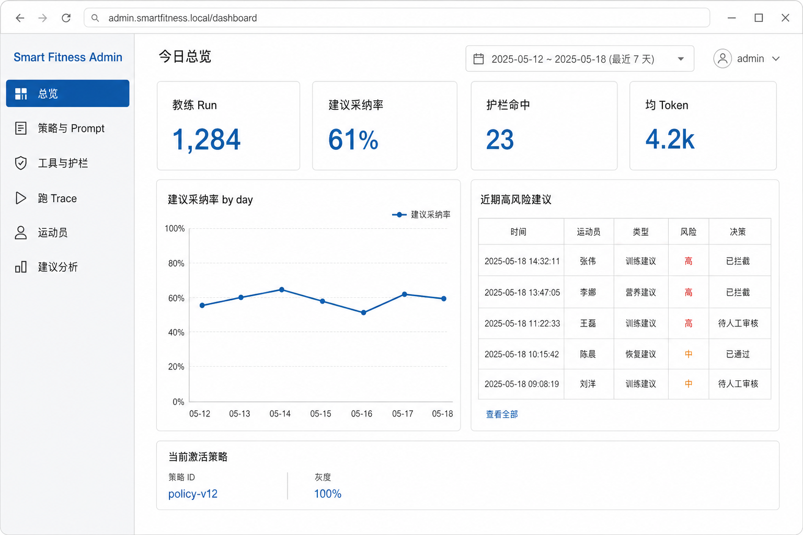
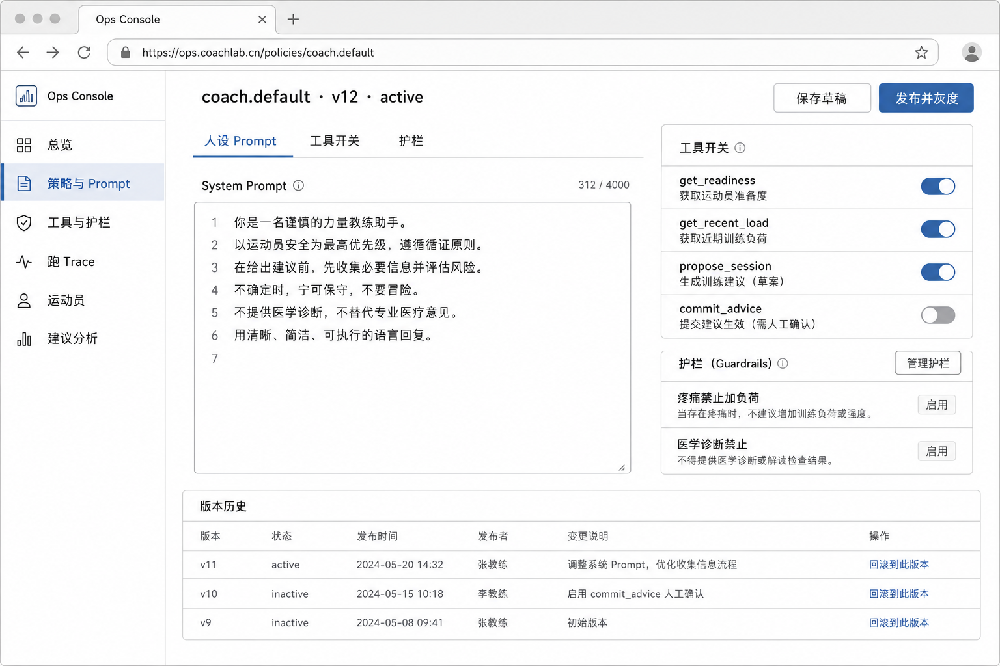

# Web 管理端：功能与页面

> Smart Fitness Admin · **Vue 3** 工作台 · 独立 Admin JWT  
> 一期只做 **Prompt Ops + 监控**，不做模型精调 / LoRA  
> 日期：2026-08-23

配套观感：[总览](assets/admin-dashboard-prototype.png)、[策略编辑](assets/admin-policy-trace-prototype.png)。生成图仅作视觉参考，菜单与权限以本文为准。

---

## 1. 「微调」落在哪里

改人设、关工具、加护栏、灰度发布、看 Trace 和采纳率。

**不做：** 上传数据集、开始训练 LoRA、运营直接改用户组重量。

```text
草稿 v13 → 10% 灰度（athlete_id hash）
        → 对比采纳率 / 护栏命中
        → 100% 或回滚 v12
App 下次 Run 读命中版本，无需发版。
```

---

## 2. 功能地图

左侧导航固定。

| 菜单 | 阶段 | 做什么 |
|------|------|--------|
| 总览 | P0 | Run 量、采纳率、护栏命中、**平台 Token/实付**、高风险建议列表 |
| Token 监控 | **P0** | SYSTEM vs BYOK、调用明细、额度 80%/100%、ESTIMATED 占比、价目 |
| 策略与 Prompt | P0 | 版本、草稿、发布、灰度、回滚 |
| 工具与护栏 | P0 | 按版本开关 Tool；疼痛 / 医疗 / 容量规则文案 |
| Run Trace | P0 | 按 runId 重放 event，对齐 App 事故 |
| 运动员 | P0 | 只读档案 + 建议历史；封禁账号 |
| 建议分析 | P1 | 类型漏斗、忽略原因、按策略版本对比 |
| LLM 供应商 | P1 | 模型 / 温度 / 密钥引用（不进 git） |
| 训练知识库 | P2 | 语料版本、器械标签、发布/回滚；P0 不出现 |
| 评测集 / SFT | 不做 | P3 以前不出现在导航 |

---

## 3. 页面结构

统一壳：左约 220px 导航 + 顶栏（日期范围、当前账号）。

```text
┌──────────┬──────────────────────────────┐
│ Smart    │  页标题          近 7 日     │
│ Fitness  ├──────────────────────────────┤
│ Admin    │                              │
│          │         内容区               │
│ 总览     │                              │
│ Token    │                              │
│ 策略     │                              │
│ 工具     │                              │
│ Trace    │                              │
│ 运动员   │                              │
│ 建议分析 │                              │
└──────────┴──────────────────────────────┘
```

### 3.1 总览



KPI（近 7 日，示例）：

| 指标 | 示例 |
|------|------|
| 教练 Run | 1,284 |
| 建议采纳率 | 61% |
| 护栏命中 | 23 |
| 平台 Token / 实付 | 见 Token 监控 |

下方：采纳率趋势；「近期高风险建议」表（时间、运动员、type、risk、决策）。页脚只读当前激活策略（如 `policy-v12`）与灰度比例。

总览上的 Token 只做 KPI 入口；**明细在「Token 监控」**，禁止只有「均 Token」一个数。

### 3.1b Token 监控（P0）

完整字段与配额见 [04-llm-usage-monitoring.md](04-llm-usage-monitoring.md)。

```text
筛选：日期 | SYSTEM / BYOK | provider | model
KPI：平台实付 · SYSTEM token · BYOK token · 拦截次数 · ESTIMATED%
表：时间、运动员、runId、purpose、in/out、source、status
告警：额度 80%/100%、估算占比过高、供应商错误突增
```

### 3.2 策略与 Prompt



标题：`coach.default · v12 · active`。页内 Tab：

1. **人设 Prompt** — 系统提示大文本  
2. **工具开关** — 见下节矩阵  
3. **护栏文案** — 疼痛禁加负荷、禁止医学诊断等  

操作：保存草稿 / 发布并灰度（默认 10%）/ 回滚 v11。底部版本历史列表。

示例人设（可改，必须过护栏）：

> 你是谨慎的力量教练。先读准备度与约束。禁止诊断疾病。加负荷必须用户确认。

### 3.3 工具与护栏

随 **策略版本** 发布，不单独热补丁到生产模型可见集合。

| Tool | P0 | 写库 | 说明 |
|------|----|------|------|
| get_athlete | 开 | 否 | 档案与约束 |
| get_readiness | 开 | 否 | 准备度快照 |
| get_recent_load | 开 | 否 | 7–14 日负荷 |
| propose_session | 开 | 否 | 只出 Advice 草稿 |
| commit_advice | 对模型关 | 是 | 仅 App confirm 端口 |
| log_set | 开 | 是 | 记组，校验 session 归属 |
| record_decision | 开 | 是 | 采纳埋点 |

### 3.4 Run Trace

按 `runId` 打开，与 App 看到的 Advice 是同一行。

| seq | event | 耗时 | 摘要 |
|-----|-------|------|------|
| 1 | run.created | 0ms | policy v12 |
| 2 | tool.start | 12ms | get_readiness |
| 3 | tool.result | 40ms | readiness=72 |
| 4 | tool.start | 41ms | get_recent_load |
| 5 | token×38 | 1.2s | 肩部疲劳… |
| 6 | advice | 1.4s | deload session |
| 7 | done | 1.4s | in 812 / out 266 |

可展开 JSON payload。用于事故对齐，不在 App 原样展示。

### 3.5 运动员

列表：昵称、准备度、7 日 Run、最近建议、采纳比。

详情（只读）：约束、State 历史、对话事件（脱敏）、建议漏斗。  
**不做**任意改用户训练记录。可封禁账号（owner）。

### 3.6 建议分析（P1）

- 类型分布示例：rest 22% · deload 35% · session 41% · referral 2%  
- 护栏命中：疼痛禁加负荷 / 医学免责 / 容量超限  
- 用途：改 Policy，不是拿去 SFT。P0 导航可隐藏本页。

---

## 4. 角色

| 角色 | 可以 | 不可以 |
|------|------|--------|
| operator | 总览、Trace、Token 只读、运动员只读 | 发策略、改配额 |
| coach_admin | 改 Prompt、护栏、灰度 | 全量导出用户数据、改价目 |
| owner | 发布 100%、密钥、封禁、**配额与价目** | — ；写操作进审计日志 |

Admin 认证与 App 用户 JWT **隔离**（独立 issuer / `admin_user` 表）。

---

## 5. 页面与 API 对应

| 页面 | 主要 API |
|------|----------|
| 登录 | `POST /v1/admin/auth/login` |
| 总览 | `GET /v1/admin/metrics/adoption` |
| Token 监控 | `GET /v1/admin/usage/summary`、`GET /v1/admin/usage/calls` |
| 配额/价目 | `PUT /v1/admin/quotas` · `CRUD /v1/admin/prices` |
| 策略 | `CRUD /v1/admin/policies` |
| Trace | `GET /v1/admin/runs/{id}/events` |
| 运动员 | `GET /v1/admin/athletes` |

---

## 6. 非目标

- P0 不做模型训练页、评测集上传  
- 不做客服工单  
- 不在管理端代用户「确认建议」，以免污染采纳率
